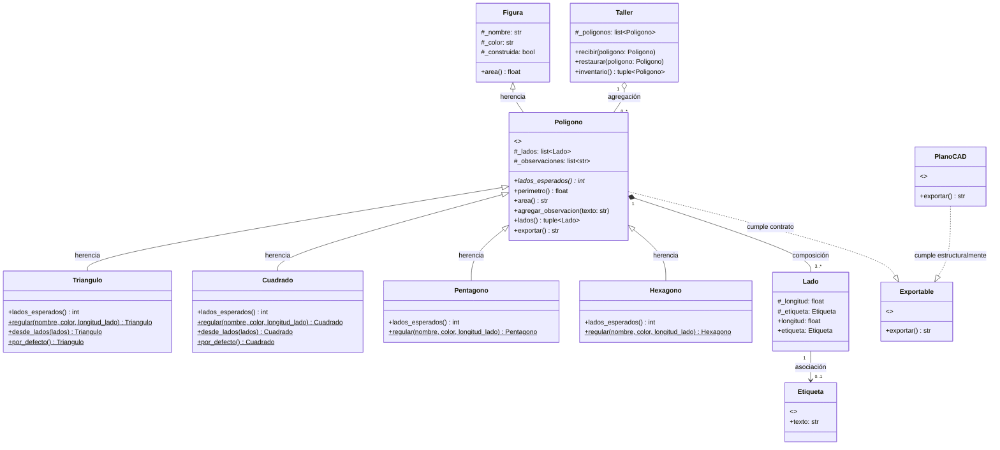

# Diagrama de Clases UML Final

```mermaid
classDiagram
    class Exportable {
        <>
        +exportar() str
    }

    class Figura {
        #_nombre: str
        #_color: str
        #_construida: bool
        +area() float
    }

    class Poligono {
        <>
        #_lados: list~Lado~
        #_observaciones: list~str~
        +lados_esperados()* int
        +perimetro() float
        +area() str
        +agregar_observacion(texto: str)
        +lados() tuple~Lado~
        +exportar() str
    }

    class Lado {
        #_longitud: float
        #_etiqueta: Etiqueta
        +longitud: float
        +etiqueta: Etiqueta
    }

    class Etiqueta {
        <>
        +texto: str
    }

    class Taller {
        #_poligonos: list~Poligono~
        +recibir(poligono: Poligono)
        +restaurar(poligono: Poligono)
        +inventario() tuple~Poligono~
    }

    class Triangulo {
        +lados_esperados() int
        +regular(nombre, color, longitud_lado)$ Triangulo
        +desde_lados(lados)$ Triangulo
        +por_defecto()$ Triangulo
    }

    class Cuadrado {
        +lados_esperados() int
        +regular(nombre, color, longitud_lado)$ Cuadrado
        +desde_lados(lados)$ Cuadrado
        +por_defecto()$ Cuadrado
    }

    class Pentagono {
        +lados_esperados() int
        +regular(nombre, color, longitud_lado)$ Pentagono
    }

    class Hexagono {
        +lados_esperados() int
        +regular(nombre, color, longitud_lado)$ Hexagono
    }

    class PlanoCAD {
        <>
        +exportar() str
    }

    Figura <|-- Poligono : herencia
    Poligono <|-- Triangulo : herencia
    Poligono <|-- Cuadrado : herencia
    Poligono <|-- Pentagono : herencia
    Poligono <|-- Hexagono : herencia

    Poligono "1" *-- "3..*" Lado : composición
    Lado "1" --> "0..1" Etiqueta : asociación
    Taller "1" o-- "0..*" Poligono : agregación

    Poligono ..|> Exportable : cumple contrato
    PlanoCAD ..|> Exportable : cumple estructuralmente
```